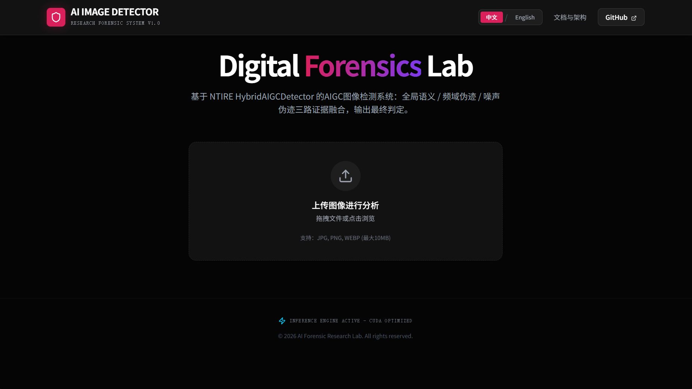
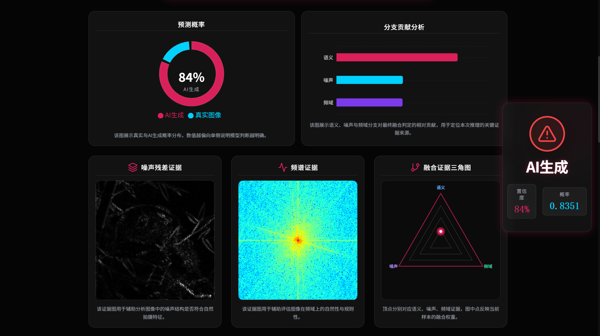
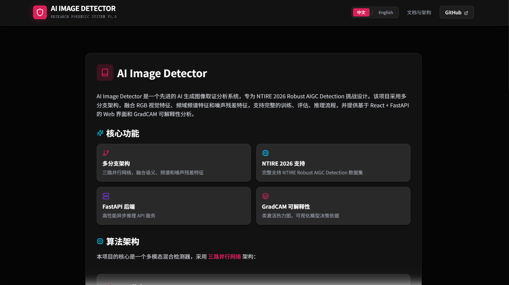

# AI Image Detector


一个面向真实场景的 AI 生成图像检测项目，包含训练算法、推理服务、Web 前端和论文级实验分析工具链。

本次 GitHub 公开版命名为 **v5**。需要特别说明的是：仓库当前对齐的本地最终模型演进线已经到 **V10**，但中间的 v5-v9 内部迭代没有逐版公开上传，因此本次公共发布直接采用 `v5` 作为新的 GitHub 版本号。

## 项目亮点

- 完整工程闭环：训练、评估、推理、后端接口、前端展示、实验报告全部已打通。
- 最终部署路径清晰：当前默认推理模式为 `base_only`，主决策路径由 `semantic + frequency` 组成，`noise` 分支保留为辅助诊断。
- 真实问题驱动优化：重点解决了 `noise shortcut` 和 `hard-real` 误判问题，而不是只靠调阈值“刷分”。
- 面向答辩与复现：仓库保留了论文报告、图表生成脚本、Notebook 和结构化文档，适合毕业设计、竞赛总结和二次开发。

## 性能快照

以下结果来自最终 V10 路线在 `photos_test` 上的代表性表现，用于说明当前版本的工程效果与边界改进趋势。

| 场景 | Threshold | Precision | Recall | F1 | FP | FN |
| --- | ---: | ---: | ---: | ---: | ---: | ---: |
| 召回优先 | `0.20` | `0.8182` | `1.0000` | `0.9000` | `2` | `0` |
| 默认平衡 | `0.35` | `1.0000` | `1.0000` | `1.0000` | `0` | `0` |

关键结论：

- `FP` 从历史基线的 `8` 降到了 `2`
- `Recall = 1.0`
- `F1 ≈ 0.9`
- `real7` 等 hard-real 样本被有效修复
- 最终模型仍然偏向 `frequency`，`semantic` 分支还有继续增强空间

## 系统截图

| 主界面 | 检测分析页 |
| --- | --- |
|  |  |

| 文档引导页 |
| --- |
|  |

## 仓库结构

```text
ai-image-detector/
├── README.md
├── CHANGELOG.md
├── requirements.txt
├── pyproject.toml
├── configs/                     # 训练 / 推理配置
├── docs/                        # 文档、架构说明、论文材料
├── figures/                     # 报告图表与流程图
├── frontend/                    # React + Vite 前端
├── photos_test/                 # 小规模本地评估样例
├── scripts/                     # 训练、评估、推理、报告脚本
├── services/api/                # FastAPI 服务
├── src/ai_image_detector/       # 核心算法与推理代码
└── checkpoints/README.md        # 模型权重放置说明
```

## 快速开始

### 1. 环境准备

- Python `3.10+`
- Node.js `18+`
- npm `9+`
- 推荐使用 CUDA 环境进行训练或批量推理

### 2. 安装后端依赖

```bash
pip install -r requirements.txt
```

### 3. 安装前端依赖

```bash
cd frontend
npm install
```

### 4. 准备模型权重

公开仓库默认**不包含大体积模型权重与训练数据**。请将最终权重放在：

```text
checkpoints/best.pth
```

详细说明见 [checkpoints/README.md](checkpoints/README.md) 和 [docs/PROJECT_GUIDE.md](docs/PROJECT_GUIDE.md)。

### 5. 启动后端

```bash
python scripts/start_backend.py
```

或者：

```bash
python -m uvicorn services.api.main:app --host 0.0.0.0 --port 8000
```

### 6. 启动前端

```bash
cd frontend
npm run dev
```

默认访问地址：

- 前端：`http://localhost:5173`
- 后端：`http://localhost:8000`

## 常用命令

### 单图推理

```bash
python scripts/infer_ntire.py --image photos_test/aigc7.png --checkpoint checkpoints/best.pth
```

### 文件夹推理

```bash
python scripts/infer_ntire.py --folder photos_test --checkpoint checkpoints/best.pth --out-csv tmp/report_generation/photos_predictions.csv
```

### V10 训练

```bash
python scripts/train_v10.py --data-root /path/to/NTIRE-RobustAIGenDetection-train --save-dir outputs/v10_experiment --pretrained-backbone
```

### V10 评估

```bash
python scripts/evaluate_v10.py --checkpoint checkpoints/best.pth --data-root /path/to/NTIRE-RobustAIGenDetection-train --output-dir outputs/v10_eval
```

### 报告图表生成

```bash
python scripts/generate_report_artifacts.py
```

## 当前默认配置

- 默认模型路径：`checkpoints/best.pth`
- 默认推理模式：`base_only`
- 默认阈值档位：`balanced`
- 当前仓库推理配置：`recall-first=0.20`、`balanced=0.35`、`precision-first=0.35`

如果你更关心实验分析而不是部署默认值，可以结合 [docs/Thesis/README.md](docs/Thesis/README.md) 查看论文报告中记录的阈值扫描与误差分析结论。

## 技术栈

### 后端与算法

- PyTorch
- timm / open_clip
- FastAPI
- NumPy / pandas / scikit-learn
- matplotlib / seaborn / openpyxl

### 前端

- React 18
- Vite
- Framer Motion
- Recharts

## 文档导航

- [CHANGELOG.md](CHANGELOG.md)：版本更新记录
- [docs/PROJECT_GUIDE.md](docs/PROJECT_GUIDE.md)：合并后的项目说明、数据与权重说明、公开仓库使用指南
- [docs/architecture.md](docs/architecture.md)：架构图与流程图
- [docs/Thesis/README.md](docs/Thesis/README.md)：毕设 / 技术报告相关材料入口

## 公开仓库策略

为了让仓库更适合 GitHub 公开维护，本次 v5 发布做了以下整理：

- 合并零散说明文档，保留更清晰的文档入口
- 删除或忽略本地缓存、训练输出、临时文件和重复模型副本
- 移除不适合公开保留的旧云训练说明和敏感连接信息
- 不再把超大训练数据、历史归档和中间 checkpoint 纳入版本库

## 适用场景

- 本科毕业设计项目展示
- AIGC 检测方向竞赛项目归档
- FastAPI + React 全栈部署示例
- 多分支图像取证模型的研究型基线工程

## 致谢

本项目围绕 NTIRE 鲁棒 AIGC 检测任务展开，结合实际工程部署与论文写作需求完成整理。若你基于此仓库继续扩展，建议优先阅读 [docs/PROJECT_GUIDE.md](docs/PROJECT_GUIDE.md)。
