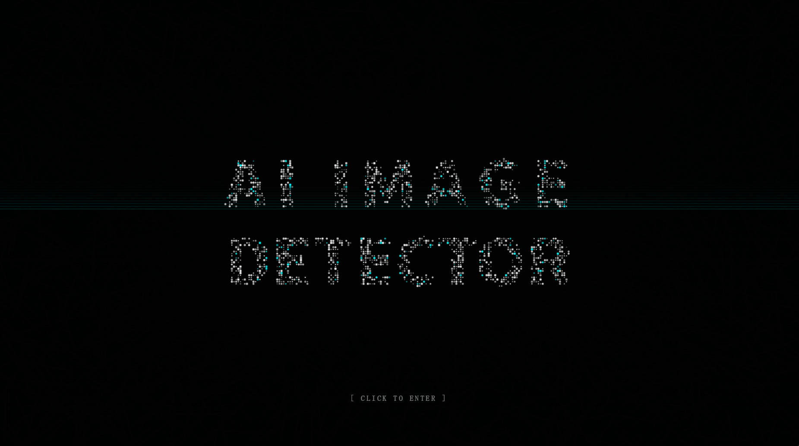
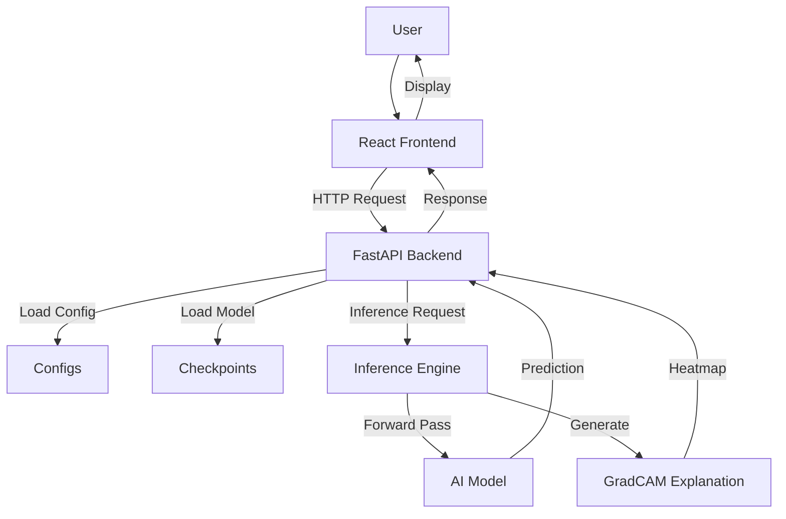
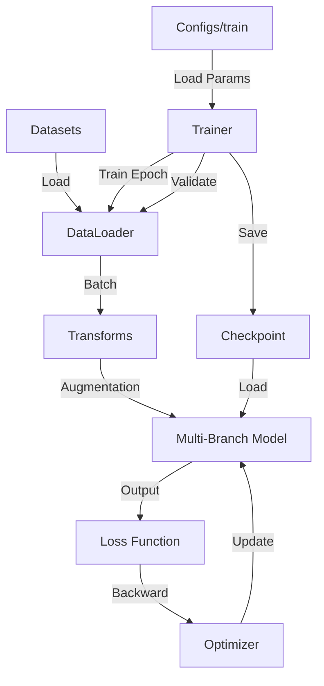
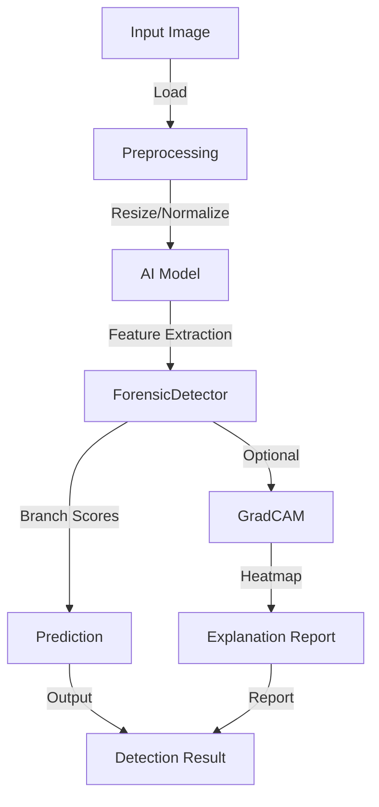
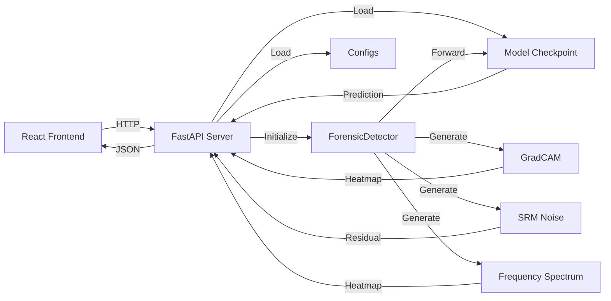

# 🔍 AI Image Detector

AI Image Detector 是一个先进的 AI 生成图像取证分析系统，专为 NTIRE 2026 Robust AIGC Detection 挑战设计。该项目采用多分支架构，融合 RGB 视觉特征、频域频谱特征和噪声残差特征，支持完整的训练、评估、推理流程，并提供基于 React + FastAPI 的 Web 界面和 GradCAM 可解释性分析。

***

## 1️⃣ Key Features

- **Multi-Branch Architecture**: 三路并行网络（RGB/Frequency/Noise），融合语义、频谱和噪声残差特征
- **NTIRE 2026 Support**: 完整支持 NTIRE Robust AIGC Detection 数据集和评估标准
- **Training / Evaluation / Inference Pipelines**: 端到端的训练、评估和推理流程
- **FastAPI Backend Service**: 高性能异步推理 API
- **React Frontend Interface**: 现代化 Web 界面，支持图像上传和结果可视化
- **GradCAM Explainability**: 类激活热力图，可视化模型决策依据
- **YAML/Config-Driven Workflow**: 灵活的配置文件驱动设计

***

## 2️⃣ Screenshots

以下是 AI Image Detector 系统的界面截图，展示了完整的用户交互流程：

### 登录界面
用户登录入口，支持身份验证和系统访问控制：



### 主界面
系统核心操作界面，提供图像上传、检测触发和结果概览功能：


### 分析面板
详细的检测结果可视化界面，展示概率分布、分支贡献度和可解释性分析：


### 文档介绍
项目架构和技术文档说明页面，帮助用户理解系统工作原理：


***

## 3️⃣ Architecture Overview

本项目的核心是一个多模态混合检测器，其结构设计如下：

```
      Input Image
           │
  ┌────────┼──────────┐
  │        │          │
  ▼        ▼          ▼
 RGB   Frequency    Noise
Branch   Branch     Branch
(CLIP ViT) (FFT+CNN) (SRM+CNN)
  │        │          │
  └────────┼──────────┘
           ▼
     Gated Fusion
    (Feature Concat)
           ▼
    Binary Classifier
           ▼
      Prediction
     (REAL vs AIGC)
```

- **RGB Branch**: 使用预训练的 CLIP ViT 提取高层语义特征
- **Frequency Branch**: 通过 FFT 变换提取图像的频域特征
- **Noise Branch**: 利用 SRM 滤波器提取噪声残差

### 3.1 System Architecture



### 3.2 Training Pipeline



### 3.3 Inference Pipeline



更多详细的架构图请参考 [docs/architecture.md](docs/architecture.md)。

***

## 3️⃣ Backend API

本项目提供基于 FastAPI 的高性能推理后端，支持完整的图像检测和可解释性功能。

### 3.1 Architecture



### 3.2 API Endpoints

- **POST /detect**: 主检测接口，上传图像获取检测结果
- **POST /detect/debug**: 调试模式接口，返回完整的调试信息

### 3.3 Key Features

- **React Frontend**: 现代化的 Web 界面，支持图像上传和结果可视化
- **FastAPI Backend**: 高性能异步 API，支持并发请求
- **AI Inference**: 集成 ForensicDetector 封装的多分支模型推理
- **GradCAM Explainability**: 生成类激活热力图，可视化模型决策依据

***

## 4️⃣ Detection Pipeline

完整的检测流程如下：

```
Image
  ↓
Preprocessing (Resize, Normalize)
  ↓
Feature Extraction (RGB, Freq, Noise)
  ↓
Feature Fusion (Gated Attention)
  ↓
Classifier (MLP Head)
  ↓
Probability Calibration (Temperature Scaling)
  ↓
Prediction & Explanation Generation
```

***

## 5️⃣ Project Structure

```
ai-image-detector/
 ├── configs/              # YAML 配置文件
 ├── docs/                 # 项目文档
 │    └── architecture.md  # 架构图文档
 ├── frontend/             # React 前端
 ├── scripts/              # 命令行工具
 │    ├── tools/           # 辅助工具脚本
 │    ├── train.py         # 通用训练入口
 │    ├── evaluate.py      # 通用评估入口
 │    ├── infer.py         # 通用推理入口
 │    ├── train_ntire.py   # NTIRE 训练入口
 │    ├── evaluate_ntire.py # NTIRE 评估入口
 │    ├── infer_ntire.py   # NTIRE 推理入口
 │    └── start_backend.py # 后端服务启动
 ├── services/             # 后端 API 服务
 │    └── api/
 ├── src/                  # 源代码
 │    └── ai_image_detector/
 │         ├── datasets/    # 数据集定义
 │         ├── models/      # 模型定义
 │         ├── ntire/       # NTIRE 专用模块
 │         ├── training/    # 训练逻辑
 │         ├── inference/   # 推理封装
 │         ├── evaluation/  # 评估逻辑
 │         ├── explain/     # 可解释性工具
 │         ├── data/        # 数据加载
 │         └── utils/       # 工具函数
 └── requirements.txt       # 项目依赖
```

**关键模块说明**:

- `src/ai_image_detector/models`: 包含 `HybridAIGCDetector` 及其子模块
- `src/ai_image_detector/ntire`: NTIRE 2026 挑战专用模块
- `src/ai_image_detector/training`: 实现了带有混合精度和 EMA 的 Trainer
- `services/api`: 基于 FastAPI 的高性能推理服务
- `frontend`: 基于 React + Vite 的可视化分析仪表板

***

## 6️⃣ Installation

### 6.1 Python 依赖安装

```bash
git clone <repo_url>
cd ai-image-detector
pip install -r requirements.txt
```

### 6.2 GPU 支持 (推荐)

为了获得最佳性能，请安装支持 CUDA 的 PyTorch 版本：

```bash
pip install torch torchvision --extra-index-url https://download.pytorch.org/whl/cu118
```

### 6.3 Frontend 依赖安装

```bash
cd frontend
npm install
```

***

## 7️⃣ Dataset

本项目使用 **NTIRE-RobustAIGenDetection-train** 数据集进行训练。数据集结构：

```
NTIRE-RobustAIGenDetection-train/
 ├── shard_0/
 ├── shard_1/
 ├── shard_2/
 └── ...
```

可选下载验证集和测试集：

```bash
huggingface-cli download deepfakesMSU/NTIRE-RobustAIGenDetection-val --repo-type dataset --local-dir NTIRE-RobustAIGenDetection-val
huggingface-cli download deepfakesMSU/NTIRE-RobustAIGenDetection-test --repo-type dataset --local-dir NTIRE-RobustAIGenDetection-test
```

***

## 8️⃣ Training

### 8.1 通用训练

使用 `scripts/train.py` 启动通用训练：

```bash
python scripts/train.py --config configs/train/default.yml
```

### 8.2 NTIRE 训练

使用 `scripts/train_ntire.py` 启动 NTIRE 训练（推荐）：

```bash
python scripts/train_ntire.py --data-root ./NTIRE-RobustAIGenDetection-train --save-dir ./checkpoints_ntire
```

**NTIRE 训练流程**:

1. 加载 NTIRE-RobustAIGenDetection-train 数据集
2. 初始化多分支架构（CLIP ViT + Frequency + Noise）
3. 执行训练循环：Forward -> Loss (BCE + Focal) -> Backward -> Optimizer
4. 每个 Epoch 更新 EMA 模型并在验证集上评估
5. 保存最佳模型和最新检查点

更多 NTIRE 训练细节请参考 [docs/NTIRE\_2026\_FINAL\_PIPELINE.md](docs/NTIRE_2026_FINAL_PIPELINE.md)。

***

## 9️⃣ Evaluation

### 9.1 通用评估

使用 `scripts/evaluate.py` 进行评估：

```bash
python scripts/evaluate.py --config configs/eval/default.yml --checkpoint checkpoints/best.pth
```

### 9.2 NTIRE 评估

使用 `scripts/evaluate_ntire.py` 进行 NTIRE 评估：

```bash
python scripts/evaluate_ntire.py --data-root ./NTIRE-RobustAIGenDetection-train --checkpoint checkpoints_ntire/best.pth
```

**输出指标**:

- **AUROC**: ROC 曲线下面积
- **AUPRC**: PR 曲线下面积
- **F1-score**: 精确率和召回率的调和平均数
- **Precision / Recall**: 精确率和召回率
- **ECE**: 期望校准误差

***

## 🔟 Inference

### 10.1 通用命令行推理

对单张图像进行快速检测：

```bash
python scripts/infer.py --image example.jpg --model checkpoints/best.pth
```

### 10.2 NTIRE 推理

使用 `scripts/infer_ntire.py` 进行 NTIRE 推理：

```bash
python scripts/infer_ntire.py --checkpoint checkpoints_ntire/best.pth --image example.jpg
```

支持多尺度推理和 TTA：

```bash
python scripts/infer_ntire.py --checkpoint checkpoints_ntire/best.pth --folder ./eval_images --scales 224 336 --tta-flip
```

***

## 1️⃣2️⃣ NTIRE Pipeline

NTIRE 2026 Robust AIGC Detection 是项目的正式支持部分，提供完整的训练、评估和推理流程。

### 12.1 NTIRE 训练

```bash
python scripts/train_ntire.py --data-root ./NTIRE-RobustAIGenDetection-train --save-dir ./checkpoints_ntire --epochs 20 --batch-size 24
```

### 12.2 NTIRE 评估

```bash
python scripts/evaluate_ntire.py --data-root ./NTIRE-RobustAIGenDetection-train --checkpoint checkpoints_ntire/best.pth
```

### 12.3 NTIRE 推理

```bash
python scripts/infer_ntire.py --checkpoint checkpoints_ntire/best.pth --image example.jpg
```

完整的 NTIRE 文档请参考 [docs/NTIRE\_2026\_FINAL\_PIPELINE.md](docs/NTIRE_2026_FINAL_PIPELINE.md)。

***

## 1️⃣2️⃣ API Service

启动后端 API 服务以支持 Web 界面或远程调用：

```bash
python scripts/start_backend.py
```

服务默认运行在 `http://localhost:8000`。

***

## 1️⃣3️⃣ Frontend

启动 React 前端开发服务器：

```bash
cd frontend
npm run dev
```

构建生产版本：

```bash
cd frontend
npm run build
```

***

## 1️⃣4️⃣ GradCAM

测试 GradCAM 可解释性功能：

```bash
python scripts/tools/test_gradcam.py --image example.jpg --model checkpoints/best.pth
```

输出将保存到 `outputs/gradcam_outputs/` 目录。

***

## 1️⃣5️⃣ Explainability

本项目特别强调可解释性，提供多种分析工具：

- **Grad-CAM**: 生成类激活热力图，高亮显示模型认为"伪造"的图像区域
- **Branch Contribution**: 量化 RGB、频域和噪声三个分支对最终决策的贡献比例
- **Spectrum Analysis**: 可视化图像的频域分布
- **Noise Residuals**: 展示经过 SRM 滤波后的噪声残差图

***

## 1️⃣6️⃣ Configuration

项目使用 YAML 文件进行配置管理。配置文件位于 `configs/` 目录下。

主要配置文件：

- `configs/train/default.yml`: 训练配置
- `configs/eval/default.yml`: 评估配置
- `configs/infer/default.yml`: 推理配置
- `configs/deploy/default.yml`: 部署配置

***

## 1️⃣7️⃣ Development Notes

- `src/ai_image_detector/`: 核心代码目录
- `scripts/`: 命令行入口脚本
- `configs/`: 配置文件目录
- `frontend/`: React Web UI
- `docs/`: 项目文档

