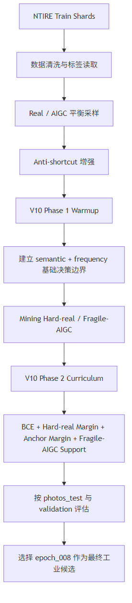
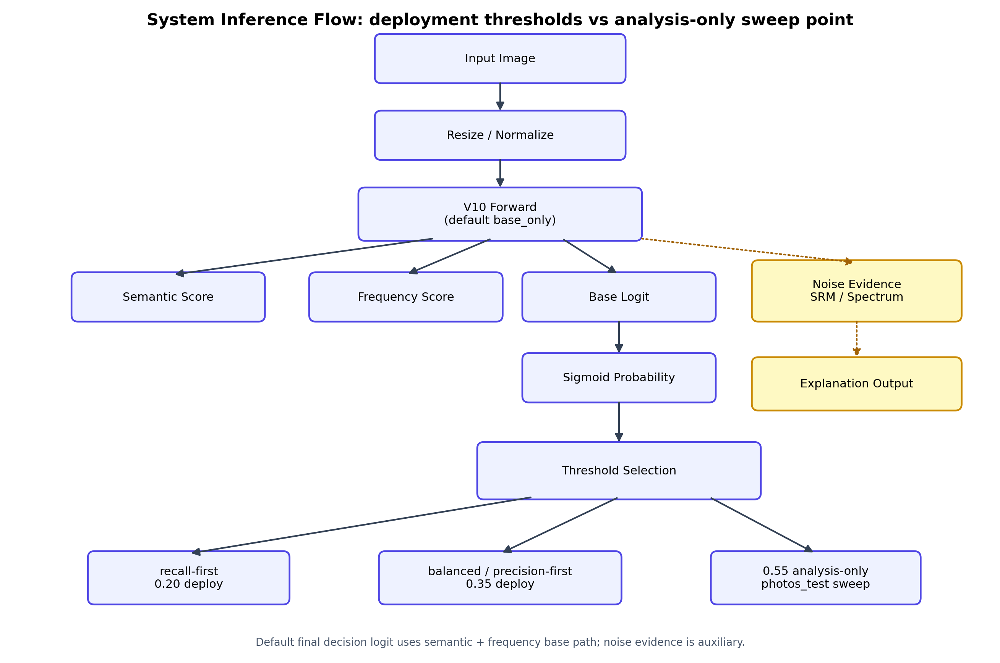
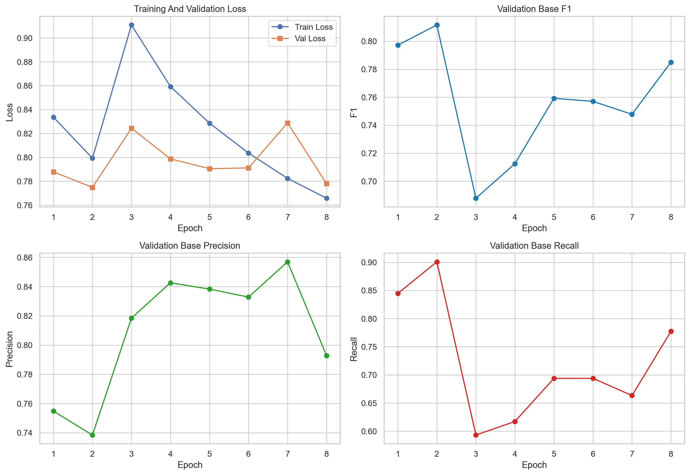
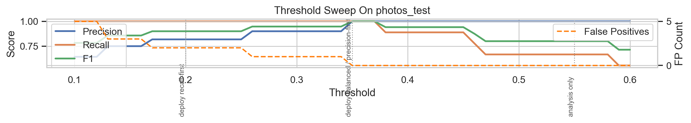
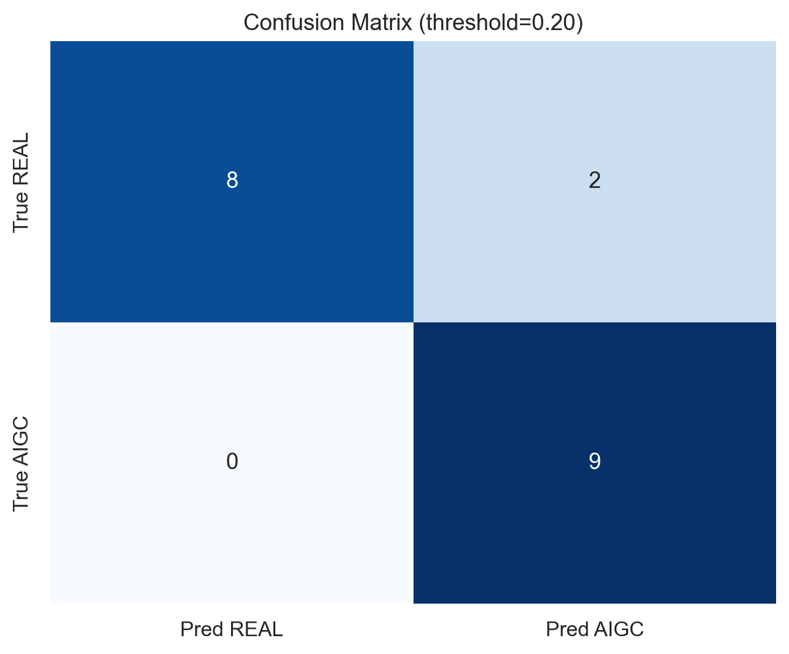
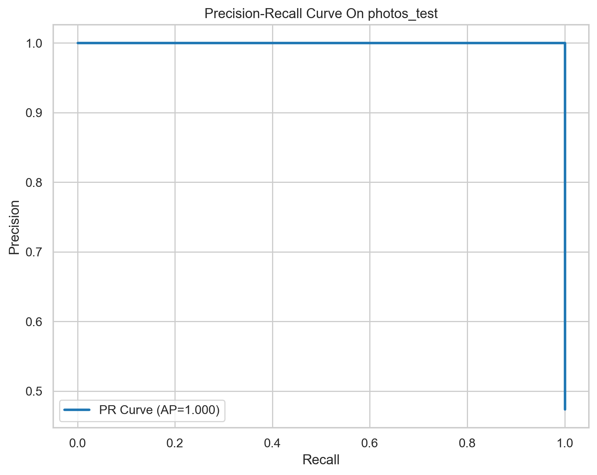

# 摘要

随着 Stable Diffusion、Midjourney 等 AIGC 工具快速普及，图像生成质量显著提升，虚假图像、伪造证据与内容审核风险也同步上升。面向这一背景，本文围绕“人工智能图像生成技术检测工具的实现”开展研究，目标是在保持工程可部署性的前提下，实现对真实图像与 AI 生成图像的鲁棒二分类检测。

本项目最终采用的部署模型为 `checkpoints/best.pth`，来源于 `V10 Phase2 epoch_008`，推理模式为 `base_only`。在方法层面，项目经历了从多分支融合到主路径收缩的演进：前期探索了“多分支 + 门控融合”架构，将语义、频域、噪声三类证据联合建模；中期针对真实图像误报严重的问题，完成了对噪声捷径的定位与修复；后期将最终决策收缩为语义与频域的基础路径，并通过困难真实样本课程学习进一步压缩误报边界。围绕最终部署，当前系统采用召回优先（`0.20`）和平衡默认（`0.35`）为主要阈值；`0.55` 仅作为 `photos_test` 小规模诊断中的高精度分析点，不作为当前部署默认值。

实验结果表明，项目最终版本在 `photos_test` 上实现了清晰的性能突破。在召回优先阈值 `0.20` 下，模型将误报数从历史基线的 `8` 降至 `2`，同时保持召回率为 `1.0`，`F1=0.90`；在平衡阈值 `0.35` 下，当前测试集上可达到更强的精度控制。进一步分析显示，`real7` 等困难真实样本得到了有效修复，`aigc7` 等脆弱正样本也被重新拉回到正确判定区间。研究说明，真正有效的提升并非来自简单提高阈值，而是来自对捷径问题的结构性诊断、对困难真实样本分布的课程化建模，以及对最终决策路径的重新约束。

总体而言，本项目已经达到本科毕业设计中较高完成度，并在工程完整性、问题诊断深度和实验叙事上接近竞赛级技术报告水平。当然，当前模型仍存在语义分支偏弱、整体决策偏向频域证据的不足，这也构成了后续继续优化的重要方向。

**关键词：** AIGC 检测；图像取证；多分支模型；困难真实样本；捷径问题；阈值策略

# 第一章 绪论

## 1.1 研究背景

近年来，AIGC 图像生成技术在扩散模型与大规模视觉语言模型的推动下快速演进。以 Stable Diffusion、Midjourney 为代表的生成工具，已经能够在普通消费级设备和在线平台上生成高分辨率、高一致性的视觉内容。与此同时，AIGC 图像也逐渐进入新闻传播、内容社区、电商展示、教育资源乃至司法取证等场景，真假边界持续模糊。

对于现实系统而言，AIGC 图像的风险并不局限于“是否逼真”，更在于其可能被用于误导决策。虚假新闻中的配图伪造、社交平台上的身份与证据伪装、自动化批量生成的营销内容，都会对平台治理、公共信任与信息安全造成压力。因此，构建一个具备真实场景鲁棒性的 AI 图像检测工具，已经不只是算法研究问题，也是实际工程系统必须面对的问题。

本课题的研究主题为“人工智能图像生成技术检测工具的实现”。项目不仅包含模型训练与算法设计，还完成了后端推理服务与前端交互系统，形成了从检测模型到用户使用界面的完整闭环。因此，本文的研究对象并不是单一的分类器，而是一个兼顾算法性能、可解释性与可部署性的完整检测工具。

## 1.2 研究意义

本研究具有以下三方面意义。

第一，具有明显的安全价值。随着深度伪造与生成图像欺诈的传播路径不断扩展，检测工具已经成为内容安全系统的重要前置模块。一个误报率可控、召回稳定的检测器，能够显著降低人工审核压力，提高异常内容的筛查效率。

第二，具有明确的工程价值。许多图像取证研究在实验集上取得较高分数，但难以迁移到真实部署环境。原因在于真实世界中存在重压缩、截图传播、平台重采样、手机拍摄与后处理等复杂扰动。本项目围绕“可部署”目标进行设计，强调阈值可配置、结果可解释、前后端联动和模型更新可追踪，因此更接近真实应用场景。

第三，具有学术价值。AIGC 检测并非单纯追求更高准确率，而是一个关于泛化、捷径问题、分布偏移和多分支融合稳定性的综合问题。项目最终从“融合更多证据”走向“收缩决策路径”，这一过程本身说明：在鲁棒性任务中，问题诊断能力与错误分析深度，往往比盲目增加模型复杂度更重要。

## 1.3 研究挑战

本项目在推进过程中主要遇到了以下四类挑战。

**1. 泛化问题。** 在标准训练分布上表现较好的模型，迁移到真实图像与不同生成器样本上往往迅速退化。尤其在 `photos_test` 这类小规模但强干扰的数据上，模型容易出现“在验证集正常、在真实样本失真”的现象。

**2. 噪声捷径问题。** 早期多分支模型中，噪声分支能够快速学习到某些简单但不稳定的伪迹模式，例如压缩残差、局部噪声形态或重编码痕迹。这类信号在部分训练样本上有效，但并不等价于“是否为 AIGC”。一旦系统把这类证据误当成主判据，就会形成捷径依赖。

**3. 困难真实样本误报问题。** 项目中最难解决的不是漏检显眼的 AIGC 图，而是把某些“看起来异常”的真实照片误判为 AIGC。`real1`、`real7`、`real8` 等样本都体现出这一问题：它们可能包含复杂纹理、局部模糊、频域异常或手机后处理痕迹，导致模型在真实边界上发生漂移。

**4. 数据分布偏移。** 训练集、验证集与部署样本之间并不共享完全一致的分布。训练中学到的统计规律，在 `photos_test` 或未来真实使用场景中未必成立。阈值的选择因此不再只是数值调参，而是一个与业务成本、误报容忍度和分布漂移强相关的策略问题。

## 1.4 创新点

结合本项目的完整实现与最终结果，本文的主要创新点归纳如下。

**1. 多分支与门控融合架构的系统性探索。** 项目不是直接套用单分支二分类网络，而是系统比较了语义、频域、噪声三路特征的协同方式，并通过门控融合观察各分支在不同样本上的贡献关系，为后续结构收缩提供了依据。

**2. 噪声捷径的定位与修复。** 项目没有把误报简单归因于“数据不够”或“阈值不对”，而是通过历史评估结果与样本级输出发现噪声/残差路径存在捷径风险，进而通过基础路径重建和混合路径降级完成修复。

**3. `base_only` 决策路径的提出与验证。** 最终模型明确将语义与频域作为主决策路径，把噪声分支从默认投票中移出，仅保留为辅助诊断。该设计直接对应了模型在 `photos_test` 上从 `FP=8` 到 `FP=2` 的关键转折。

**4. 困难真实样本课程学习。** 项目通过挖掘接近决策边界的真实样本，构建困难真实样本缓冲区，并在第二阶段实施课程学习，使模型在保持召回率 `1.0` 的同时逐步缩小真实图误报。

**5. 面向部署的阈值策略设计。** 本项目没有停留在“单个最佳阈值”思路，而是形成了召回优先、平衡模式、精度优先三档策略，使模型可以根据实际业务成本在召回、误报与保守性之间切换。

# 第二章 国内外研究现状

## 2.1 AIGC 检测方法

从现有研究路径来看，AIGC 图像检测大体可以分为三类。

**基于卷积神经网络的方法。** 该类方法往往从局部纹理、边缘结构、噪声分布或压缩痕迹入手，利用卷积网络提取局部统计特征。其优点是对低层伪迹较敏感，推理速度快；缺点是容易把压缩、锐化、去噪等图像处理副作用误认为生成痕迹，从而产生捷径问题。

**基于频域的方法。** 频域方法通常对 FFT 幅值谱、谱能量分布或周期性纹理异常进行建模，适合捕捉生成图像在采样、插值和纹理组织上的不自然模式。该方向在图像伪迹检测中表现稳定，但同样容易受到真实图像后处理、平台压缩和拍摄设备差异的影响。

**基于 Transformer 的方法。** Transformer，尤其是基于 ViT 或 CLIP 的主干网络，在高层语义与全局结构建模方面具有优势，更适合识别人物、背景、光照、物体关系等宏观一致性问题。其问题在于：若直接依赖高层语义而忽略纹理与频域线索，就可能在局部伪迹明显但语义自然的样本上能力不足。

综合来看，单一路径很难覆盖真实场景中的全部异常模式。因此，多分支建模成为一个自然选择：语义负责全局，频域负责中低层统计，噪声负责残差诊断。但多分支并不天然更优，其融合方式决定了最终是否真正提升泛化能力。

## 2.2 捷径问题

捷径问题是当前 AIGC 检测研究中的核心难点之一。所谓“捷径”，是指模型依赖某些与真实任务目标并不等价、但在训练集上“看起来有效”的伪特征完成分类。例如，某些生成器输出更容易伴随特定压缩痕迹，某些真实照片更容易出现高 ISO 噪点；如果模型把这些模式直接映射为真假标签，就会在分布切换时迅速失效。

与捷径问题紧密相关的是数据集偏置与伪相关。数据集偏置会让模型高估某些低层规律的重要性，而忽视真正稳定的判别依据。对于图像取证任务而言，捷径问题的危害往往体现为两种形式：一是对“容易的 AIGC 样本”过拟合；二是把“复杂真实图像”错误地推向 AIGC 一侧。本项目中的噪声捷径与困难真实样本误报问题，本质上都属于这一类。

## 2.3 多分支模型

多分支模型试图把不同层级的证据放进同一系统中统一建模。例如，一条分支关注全局语义，一条分支关注频域纹理，一条分支关注残差噪声，然后通过特征拼接、加权求和、门控机制或混合专家方式完成融合。这一思路的理论吸引力很强，因为它允许模型同时利用多种取证线索。

但在实际工程中，多分支模型面临两个关键问题。第一，融合过程可能失败。若某一分支的学习速度更快、梯度更强，融合层会偏向该分支，从而导致其他分支形同虚设。第二，门控机制可能学到错误偏置。当门控机制把噪声残差误当成高置信证据时，模型虽然“看起来更聪明”，实则更容易在困难真实样本上翻车。

因此，多分支模型并不是“分支越多越好”，而是要在结构复杂度、泛化能力与部署稳定性之间寻找平衡。本文最终走向 `base_only`，正是基于这一认识。

# 第三章 方法设计

## 3.1 问题定义

本项目将 AIGC 图像检测定义为一个二分类问题。给定输入图像 $x$，模型输出该图像属于 `REAL` 或 `AIGC` 的概率估计，并依据阈值 $\tau$ 给出最终标签。

从工程接口看，输入为任意待检测图像，输出包括：

- 最终概率 `probability`
- 二分类标签 `label`
- 使用的阈值 `threshold_used`
- 推理模式 `mode`
- 语义 / 频域分支得分
- 解释性辅助结果，如频谱图和噪声残差图

若记模型输出的对数几率（logit）为 $z$，则 AIGC 概率可写为：

```text
p(AIGC | x) = sigmoid(z)
```

当 `p(AIGC | x) >= τ` 时，系统输出 `AIGC`，否则输出 `REAL`。当前系统的部署阈值与报告分析阈值区分如下：

- `τ = 0.20`：召回优先部署档
- `τ = 0.35`：默认平衡部署档，当前 `precision-first` 部署档也与其对齐
- `τ = 0.55`：仅用于 `photos_test` 小规模诊断的高精度分析点

## 3.2 模型架构

项目最终模型采用 V10 架构，核心思路是以语义与频域两条主路径形成稳定的基础判别边界，再把噪声分支降级为可选辅助专家与诊断证据，而不是默认投票成员。模型结构如图 3-1 所示。


图 3-1 最终 V10 `base_only` 模型结构图。

从实现上看，模型包含三部分关键组件。

- **语义分支**：使用 CLIP ViT 主干提取全局语义与结构一致性特征。
- **频域分支**：对频谱分布进行建模，重点关注纹理、压缩和谱结构异常。
- **主融合模块**：对语义与频域特征进行门控融合，生成 `base_feat` 与 `base_logit`。

在此基础上，系统保留了噪声分支以及 `NoiseControllerV10`，但默认推理模式固定为 `base_only`。这意味着：

- `base_only`：最终输出直接来自 `base_logit`
- `hybrid_optional`：只有在可选模式下，才引入 `noise_delta_logit`

因此，最终部署结构并非简单砍掉噪声分支，而是保留其辅助价值，同时避免其在默认情况下干扰主决策路径。这种“保留诊断、移出主判定”的策略，是本项目从试错走向稳定的关键。

## 3.3 `base_only` 判别机制

为什么最终采用 `base_only`，是本文方法设计中最重要的问题之一。

早期路线认为：三分支融合能获得更丰富的信息，因此应该让噪声分支持续参与最终分类。然而在实际训练与验证中，这一路线暴露出两个问题。

第一，噪声分支虽然对某些样本非常敏感，但它敏感的并不一定是“生成事实”，而可能只是压缩噪声、重采样伪影或图像后处理副作用。换言之，它更像一个强烈但不稳定的证据源。若让它直接参与最终投票，就会把捷径风险引入主路径。

第二，融合层与控制器并没有自动学会“何时该忽略噪声”。已有 V9 结果表明，在 `photos_test` 上，无论 `base_only` 还是 `hybrid`，都没有把真实误报真正压下去。尤其是 V9 的 `base_only/hybrid` 在 `threshold=0.20` 下均表现为 `FP=10、召回率=1.0、F1=0.6429`，说明问题不在于简单切换模式，而在于基础判别边界本身已被噪声路径带偏。

因此，V10 的关键不是继续堆叠控制器，而是回到 `base_logit` 本身。`base_logit` 的意义在于：它直接由语义与频域的主融合结果给出，代表模型对“核心可迁移证据”的压缩表达。把最终标签重新锚定到 `base_logit`，相当于重新规定了什么才是主判据。

这一改动带来了两个直接结果。

- 一方面，噪声捷径的影响被显著削弱，真实图像误报开始下降。
- 另一方面，模型并没有牺牲脆弱正样本，`aigc6`、`aigc7` 等在最终模型下仍然保持正确识别。

因此，`base_only` 不是“简化版模型”，而是一次明确的决策路径重构。

## 3.4 困难真实样本训练策略

在本项目中，真正决定用户体验上限的并不是普通样本，而是困难真实样本。所谓困难真实样本，是指那些来自真实拍摄、但在纹理、后处理、局部结构或频谱分布上与 AIGC 样本相似，从而容易被误判的图像。

本项目采用的困难真实样本策略可以概括为“先挖掘，再课程化学习”。

**1. 困难真实样本挖掘。** 系统在训练过程中根据 `base_probability`、`base_logit` 以及分支间不一致性，从真实样本中挖掘靠近决策边界、最容易成为误报的样本，构建 `hard_real_buffer`。这一步并不依赖人工枚举，而是让模型先暴露自身最脆弱的区域。

**2. 课程学习。** 在第二阶段中，训练不再对所有样本一视同仁，而是通过课程采样器让困难真实样本以更高频率进入批次，使模型在保证 AIGC 召回的同时，反复修正真实边界。

**3. 脆弱 AIGC 支持。** 如果只强调困难真实样本，很容易把模型推向过于保守，导致 AIGC 漏检。因此训练中同时维护脆弱 AIGC 缓冲区，对边界附近的正样本给予支持，防止模型通过“整体左移”来换取更低误报。

训练流程如图 3-2 所示。



图 3-2 V10 训练流程图。

从最终效果看，这一策略把 `photos_test` 上的误报演进路径从 `8 -> 4 -> 3 -> 2` 串联起来，说明困难真实样本课程学习并不是一次性的调参，而是一个逐步修正边界的过程。

## 3.5 损失函数设计

V10 训练器并不是只使用一个 BCE，而是围绕“稳住主边界、保护脆弱正样本、约束困难真实样本”构建了组合损失。其核心形式可表示为：

```text
L = L_BCE + λ_sem L_sem + λ_freq L_freq + λ_hr L_hr + λ_proto L_proto + λ_fragile L_fragile
```

其中主要项含义如下。

**1. BCE 主损失。**

```text
L_BCE = - [ y log p + (1 - y) log (1 - p) ]
```

该项作用于 `base_logit`，用于维持基础二分类能力，是整个训练过程的主干损失。

**2. 困难真实样本间隔损失。**

对于被挖掘出的困难真实样本，希望其 `base_logit` 更偏向真实图一侧，因此引入间隔约束：

```text
L_hr = max(0, z_base + m_hr)
```

其含义是：若真实样本的 `base_logit` 仍过高，系统会继续施加惩罚，迫使其远离 AIGC 区域。

**3. 原型损失（如有）。**

项目在训练器中为困难真实样本引入原型间隔机制，使其在特征空间上更接近真实原型、远离 AIGC 原型。该项的作用不是替代 BCE，而是让边界修正不只发生在 logit 层，也发生在表示空间层。

**4. 脆弱 AIGC 支持损失。**

该项用于保护那些本应为 AIGC、但当前概率不够高的脆弱正样本，防止困难真实样本去偏过程中出现“误伤正样本”的副作用。

总体而言，损失函数设计服务于一个明确目标：不是让所有分支都更激进，而是让 `base_logit` 形成一个更可靠、更可部署的决策边界。

# 第四章 实现与实验

## 4.1 数据集

项目训练主体使用 NTIRE 鲁棒 AIGC 检测数据集。与早期更偏向固定生成器或固定失真模式的数据相比，NTIRE 更强调真实场景中的扰动与分布变化，因此更适合本课题“部署级鲁棒性”的目标。

在实验分析中，本文重点使用 `photos_test` 作为小规模人工观察集。该集合包含 `19` 张图片，其中 `9` 张为 AIGC，`10` 张为真实图像。与大规模验证集相比，`photos_test` 的价值不在于统计显著性，而在于它包含了项目推进过程中最关键的困难真实样本与脆弱 AIGC 样本，能够直观反映边界修复是否真正发生。

具体而言：

- `real1`、`real8` 属于高风险真实样本，容易在召回优先阈值下被误判。
- `real7` 是前期被错误识别、后期成功修复的代表样本。
- `aigc7` 是脆弱正样本修复的典型案例。

## 4.2 实验设置

本项目完成于完整工程环境中，训练、算法、前后端系统均已打通。实验配置主要如下。

- 图形处理器环境：NVIDIA `RTX 4090`
- 图像尺寸：`224 x 224`
- V10 工业候选批量大小：`24`
- 工作线程数：`6`
- 学习率：`5e-5`
- 权重衰减：`1e-4`
- 梯度裁剪：`1.0`
- 主干网络：`vit_base_patch16_clip_224.openai`

从训练流程看，最终模型并非一次完成，而是采取了恢复训练的方式：

1. 第一阶段先完成预热，建立语义 + 频域的基础边界。
2. 第二阶段在此基础上恢复训练，引入困难真实样本课程学习与脆弱 AIGC 支持。
3. 最终采用的检查点为 `V10 Phase2 epoch_008`，本地部署路径为 `checkpoints/best.pth`。

这一点非常关键。因为项目的真正突破并不是“重新随机得到更好的分数”，而是在同一条工程主线中，通过有针对性的诊断与修复，逐步把模型从捷径误区拉回到稳定判别路径上。

在系统实现层面，项目已经完成了前端上传、后端推理和结果回传的完整闭环。用户提交图片后，后端统一完成预处理、`base_only` 推理、阈值判定与解释性结果组织，再将概率、标签和辅助图返回给前端界面。最终部署流程如图 4-1 所示。



图 4-1 最终检测工具的推理流程图。

## 4.3 评价指标

本文主要采用以下指标评估检测效果。

**精确率。** 表示被判为 AIGC 的样本中，真正为 AIGC 的比例。该指标越高，说明误报越少。

**召回率。** 表示所有真实 AIGC 样本中，被正确识别出来的比例。该指标越高，说明漏检越少。

**F1 值。** 精确率与召回率的调和平均，适合衡量总体阈值表现。

**AUROC。** 反映排序层面的判别质量，不依赖单一阈值。

**FP/FN。** FP 表示真实图误报数，FN 表示 AIGC 漏检数。对于部署系统而言，FP/FN 的实际数量往往比单个综合分数更具有解释力，因此本文在表格和分析中始终保留这两个指标。

## 4.4 实验结果

### 4.4.1 版本演进对比

根据项目历史记录、V9 评估文件以及当前最终模型重新推理结果，可得到表 4-1。

| 版本 | FP | FN | 精确率 | 召回率 | F1 值 |
| ---- | -- | -- | ------ | ------ | ----- |
| V8 | 8 | 0 | 0.5294 | 1.0000 | 0.6923 |
| V9 | 10 | 0 | 0.4737 | 1.0000 | 0.6429 |
| V10 | 2 | 0 | 0.8182 | 1.0000 | 0.9000 |

表 4-1 `photos_test` 上的版本对比结果，统一使用阈值 `0.20` 进行比较。

从表 4-1 可以看出，项目并不是线性上升。V9 的表现甚至低于 V8，这恰好说明问题出在结构与决策路径，而不是“训练时间不够”或“阈值没调好”。真正的突破发生在 V10：误报数由 `8` 大幅下降到 `2`，同时召回率保持 `1.0`，`F1` 提升到 `0.90`。

### 4.4.2 阈值策略结果

围绕最终模型，本文进一步得到表 4-2。

| 策略配置 | 阈值 | 精确率 | 召回率 | F1 值 | FP | FN |
| -------- | ---- | ------ | ------ | ----- | -- | -- |
| 召回优先 | 0.20 | 0.8182 | 1.0000 | 0.9000 | 2 | 0 |
| 平衡模式 | 0.35 | 1.0000 | 1.0000 | 1.0000 | 0 | 0 |
| 精度优先分析点 | 0.55 | 1.0000 | 0.6667 | 0.8000 | 0 | 3 |

表 4-2 最终 V10 模型在 `photos_test` 小规模诊断集上的阈值策略结果。

可以看到，阈值并不是越高越好。`0.55` 虽然完全压掉误报，但会牺牲 3 个 AIGC 样本的召回，因此仅保留为分析阈值；`0.20` 保持了召回率 `1.0`，同时把误报控制在 2 个以内，是更适合“宁可多报、不能漏报”的检测场景；`0.35` 在当前小规模集合上表现最均衡，因此被设为默认部署阈值。

### 4.4.3 训练与阈值可视化



图 4-2 最终检查点历史中的训练曲线，包括损失值、验证集 F1 值、精确率与召回率。



图 4-3 `photos_test` 上的阈值扫描曲线。



图 4-4 阈值 `0.20` 下的混淆矩阵。



图 4-5 最终模型在 `photos_test` 上的精确率-召回率（PR）曲线。

## 4.5 关键结果分析

本项目最有代表性的结果不是某一次“最高分”，而是误报边界被持续压缩的过程。根据最终检查点历史中的阶段性评估，`photos_test` 在阈值 `0.20` 下的误报演进路径为：

```text
epoch_002（第一阶段）: FP = 8, F1 = 0.6923
epoch_004（第二阶段）: FP = 4, F1 = 0.8182
epoch_006（第二阶段）: FP = 3, F1 = 0.8000
epoch_008（第二阶段）: FP = 2, F1 = 0.9000
```

这组结果说明：困难真实样本课程学习并不是一次性将指标“拉满”，而是逐轮修复真实边界。其中，`epoch_006` 虽然误报继续下降到 3，但召回率降为 `0.8889`，F1 反而回落；直到 `epoch_008` 才同时实现 `FP=2` 与召回率 `1.0`。这正是最终选定 `V10 Phase2 epoch_008` 的原因。

进一步看单样本变化，`real7` 的修复尤其具有代表性。早期缓存分析文件中，`real7.jpg` 曾经被列为误判样本；而在当前最终模型下，其 AIGC 概率下降到 `0.1251`，明显远离默认阈值，说明困难真实样本边界确实被重塑。与此同时，`aigc7.png` 也从早期易漏检样本恢复到 `0.6489` 的稳定正判区间，表明模型并没有通过简单“整体保守化”来减少误报。

因此，`FP 8 -> 2` 的意义不仅在于数值提升，更在于它证明了项目找到了一条正确的修复主线：先承认问题来自边界，而非只来自阈值；再通过 `base_only` 与困难真实样本课程学习去修正边界本身。

## 4.6 错误分析

尽管最终结果已经较为理想，但在阈值 `0.20` 下仍然保留了两个典型误报：`real1.jpg` 与 `real8.jpg`。二者的 AIGC 概率分别约为 `0.2590` 和 `0.3401`。

**1. real1。** 该样本在语义分支上的真实支持并不强，而其局部频率特征又不够自然，导致主路径在召回优先阈值下仍把它推向 AIGC 一侧。说明模型对某些复杂真实纹理仍存在不充分建模。

**2. real8。** 该样本是更具代表性的边界样本。其概率已经逼近 `0.35`，说明它几乎处于最终决策边界上。换言之，`real8` 并不是明显错判，而是一个最能暴露模型偏向的“边缘样本”。这也解释了为什么它在平衡阈值 `0.35` 下可以被修正，但在 `0.20` 下仍会作为 FP 出现。

这两个样本说明，当前模型虽然已经解决了大部分困难真实样本误报，但仍存在“对复杂真实图过度敏感”的尾部问题。从当前分支统计看，最终轮次的验证门控均值约为 `sf_semantic_mean=0.0704`、`sf_frequency_mean=0.9296`，这意味着模型整体仍更依赖频域证据。换言之，语义分支尚未成为与频域分支同等强度的稳定支撑，这也是模型偏频域的直接证据。

## 4.7 消融实验

### 4.7.1 `base_only` 与 `hybrid_optional` 对比

为了验证最终结构选择是否合理，本文对当前 V10 检查点的两种推理模式进行了对照，结果如表 4-3 所示。

| 模式 | 阈值 | FP | FN | 精确率 | 召回率 | F1 值 |
| ---- | ---- | -- | -- | ------ | ------ | ----- |
| base_only | 0.20 | 2 | 0 | 0.8182 | 1.0000 | 0.9000 |
| hybrid_optional | 0.20 | 2 | 0 | 0.8182 | 1.0000 | 0.9000 |
| base_only | 0.35 | 0 | 0 | 1.0000 | 1.0000 | 1.0000 |
| hybrid_optional | 0.35 | 0 | 0 | 1.0000 | 1.0000 | 1.0000 |

表 4-3 当前 V10 检查点下 `base_only` 与 `hybrid_optional` 的对比。

结果表明，在最终检查点上，把噪声路径重新接回 `hybrid_optional` 并没有带来额外收益。也就是说，V10 的提升并不是因为噪声分支“变聪明了”，而是因为默认判决不再依赖它。

### 4.7.2 有无噪声主导路径的历史对比

再结合 V9 的历史结果，可以得到更清晰的结论。V9 中，`base_only` 与 `hybrid` 在阈值 `0.20` 下都停留在 `FP=10、F1=0.6429` 左右，说明当基础边界已经失稳时，仅靠残差路径或控制器并不能修复问题。最终有效的做法是：

- 先重建语义 + 频域的基础边界
- 再把噪声从默认决策中移出
- 最后通过困难真实样本课程学习压缩真实误报

因此，本项目的消融结论非常明确：**最终性能提升主要来自“去噪声捷径化”的基础路径重建，而不是更激进的混合控制器。**

# 第五章 总结与展望

## 5.1 总结

本文围绕“人工智能图像生成技术检测工具的实现”完成了一套从模型、训练、推理到前后端系统的完整实现，并对其关键演进路径进行了系统总结。项目最终采用 `checkpoints/best.pth` 作为本地部署模型，对应 `V10 Phase2 epoch_008`，默认运行于 `base_only` 模式。

与单纯追求高分不同，本文把“问题 -> 诊断 -> 解决”作为主线展开。项目先后经历了多分支融合带来的捷径风险、困难真实样本误报、脆弱 AIGC 样本恢复等一系列问题，最终通过 `base_only` 决策路径、困难真实样本课程学习以及阈值策略设计，实现了更稳定的部署表现。

从结果看，项目已经达到较高水平。以 `photos_test` 为代表，在阈值 `0.20` 下，最终模型把误报从 `8` 降到 `2`，同时保持召回率 `1.0`，`F1=0.90`；在默认平衡阈值 `0.35` 下，当前测试集上可以进一步压低误报。对于本科毕业设计而言，这样的结果已经不仅是“完成了一个系统”，而是形成了一篇较为完整的模型演进论文：它不仅说明了最终效果，更说明了为什么早期失败、为什么中途回退、以及为什么最终方案有效。

## 5.2 展望

尽管项目已经实现了较为理想的工程闭环，但仍有若干值得继续推进的方向。

**1. 语义分支增强。** 当前模型的门控统计显示频域分支仍占主导，语义分支偏弱。后续可以通过更强的语义主干、更精细的冻结策略或语义一致性辅助目标，提升语义路径在复杂真实图上的辨别力。

**2. 多模态检测。** 仅凭图像本体进行检测，在面对未来生成器与强后处理时仍有上限。后续可考虑引入文本提示、生成轨迹、EXIF 与传播上下文等多模态信息，构建更强的联合取证框架。

**3. 更大规模泛化验证。** `photos_test` 对边界分析非常有价值，但规模有限。未来应在更多真实平台数据、跨设备图像和跨生成器样本上验证模型鲁棒性，并持续检验 `base_only` 路线是否仍然优于复杂融合。

**4. 面向产品的动态阈值策略。** 当前项目已形成三档阈值配置，但未来仍可根据业务场景动态调整。例如审核预筛阶段优先使用召回优先策略，高置信封禁场景使用精度优先策略，普通在线部署使用平衡模式。这样将使模型真正从“实验模型”过渡到“可运营工具”。

综上，本文的工作已经证明：在 AIGC 检测任务中，真正的提升来自对错误的深度理解，而不是盲目增加结构复杂度。未来若能够继续加强语义建模能力、扩展多模态证据并在更大规模数据上验证，本项目有望进一步接近成熟竞赛方案乃至真实产品级系统。
