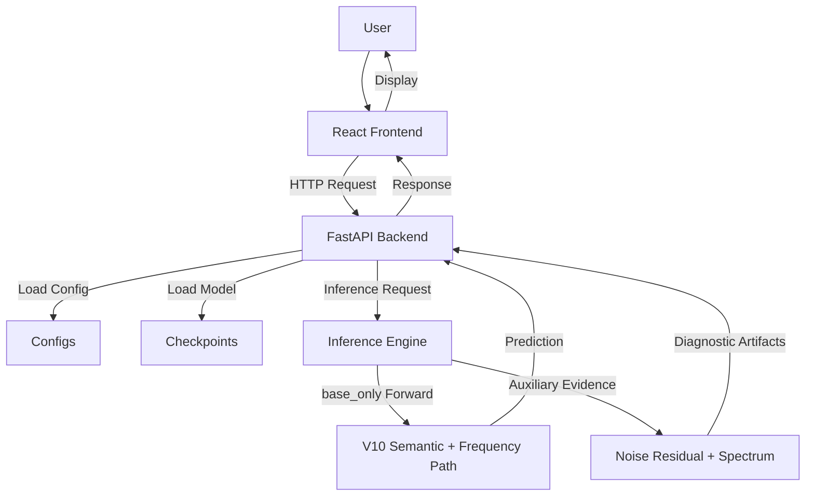
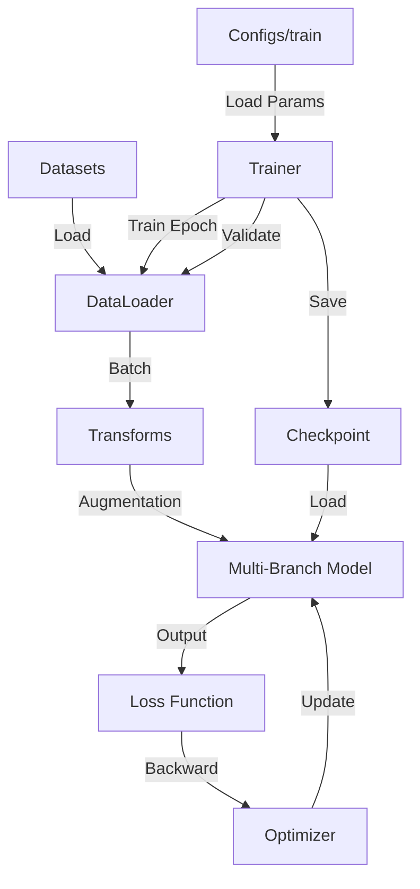
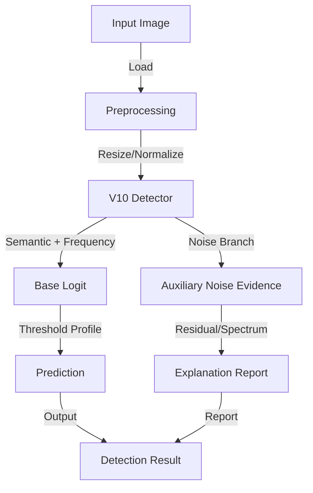
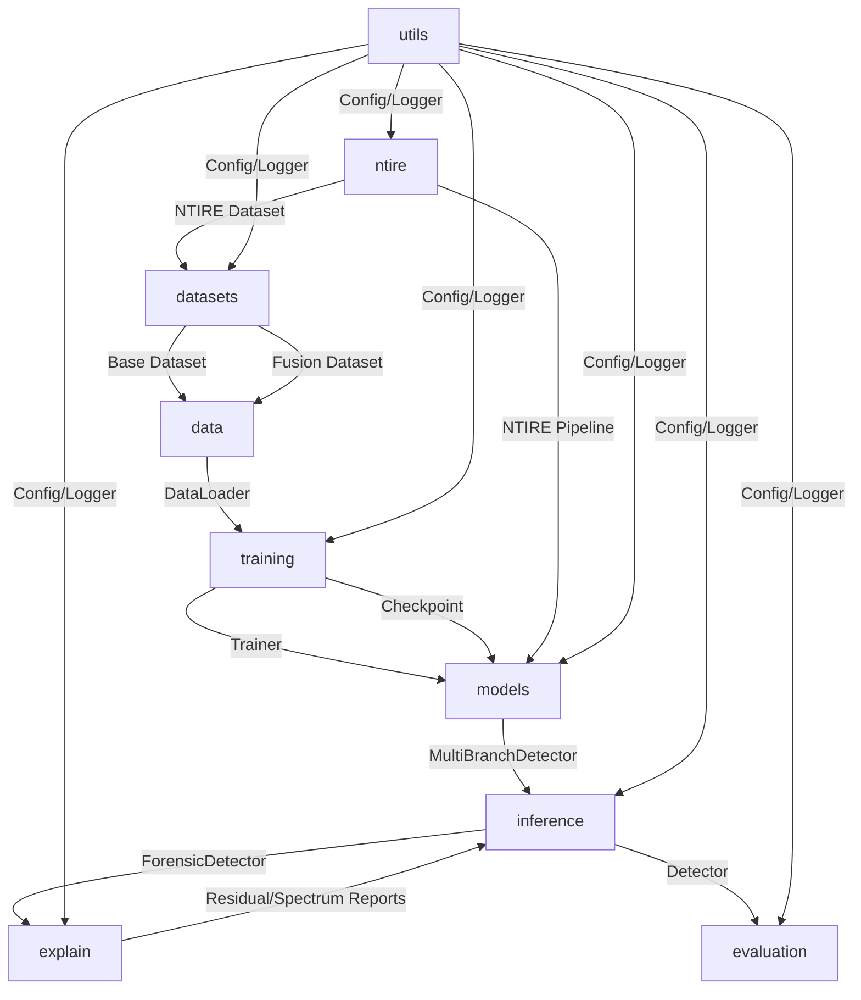

# Architecture

## System Architecture

```mermaid
graph TB
    User[User] --> Frontend[React Frontend]
    Frontend -->|HTTP Request| Backend[FastAPI Backend]
    Backend -->|Load Config| Configs[Configs]
    Backend -->|Load Model| Checkpoints[Checkpoints]
    Backend -->|Inference Request| Inference[Inference Engine]
    Inference -->|base_only Forward| Model[V10 Semantic + Frequency Path]
    Inference -->|Auxiliary Evidence| Evidence[Noise Residual + Spectrum]
    Model -->|Prediction| Backend
    Evidence -->|Diagnostic Artifacts| Backend
    Backend -->|Response| Frontend
    Frontend -->|Display| User
```

## Training Pipeline

```mermaid
graph TB
    Config[Configs/train] -->|Load Params| Trainer[Trainer]
    Dataset[Datasets] -->|Load| DataLoader[DataLoader]
    DataLoader -->|Batch| Transforms[Transforms]
    Transforms -->|Augmentation| Model[Multi-Branch Model]
    Model -->|Output| Loss[Loss Function]
    Loss -->|Backward| Optimizer[Optimizer]
    Optimizer -->|Update| Model
    Trainer -->|Train Epoch| DataLoader
    Trainer -->|Validate| DataLoader
    Trainer -->|Save| Checkpoint[Checkpoint]
    Checkpoint -->|Load| Model
```

## Inference Pipeline

```mermaid
graph TB
    Image[Input Image] -->|Load| Preprocess[Preprocessing]
    Preprocess -->|Resize/Normalize| Model[V10 Detector]
    Model -->|Semantic + Frequency| BaseLogit[Base Logit]
    Model -->|Noise Branch| AuxEvidence[Auxiliary Noise Evidence]
    BaseLogit -->|Threshold Profile| Prediction[Prediction]
    AuxEvidence -->|Residual/Spectrum| Explanation[Explanation Report]
    Prediction -->|Output| Result[Detection Result]
    Explanation -->|Report| Result
```

## Code Architecture

```mermaid
graph TD
    datasets[datasets] -->|Base Dataset| data[data]
    data -->|DataLoader| training[training]
    datasets -->|Fusion Dataset| data
    training -->|Trainer| models[models]
    models -->|MultiBranchDetector| inference[inference]
    inference -->|ForensicDetector| explain[explain]
    explain -->|Residual/Spectrum Reports| inference
    inference -->|Detector| evaluation[evaluation]
    training -->|Checkpoint| models
    ntire[ntire] -->|NTIRE Pipeline| models
    ntire -->|NTIRE Dataset| datasets
    utils[utils] -->|Config/Logger| datasets
    utils -->|Config/Logger| models
    utils -->|Config/Logger| training
    utils -->|Config/Logger| inference
    utils -->|Config/Logger| evaluation
    utils -->|Config/Logger| explain
    utils -->|Config/Logger| ntire
```
